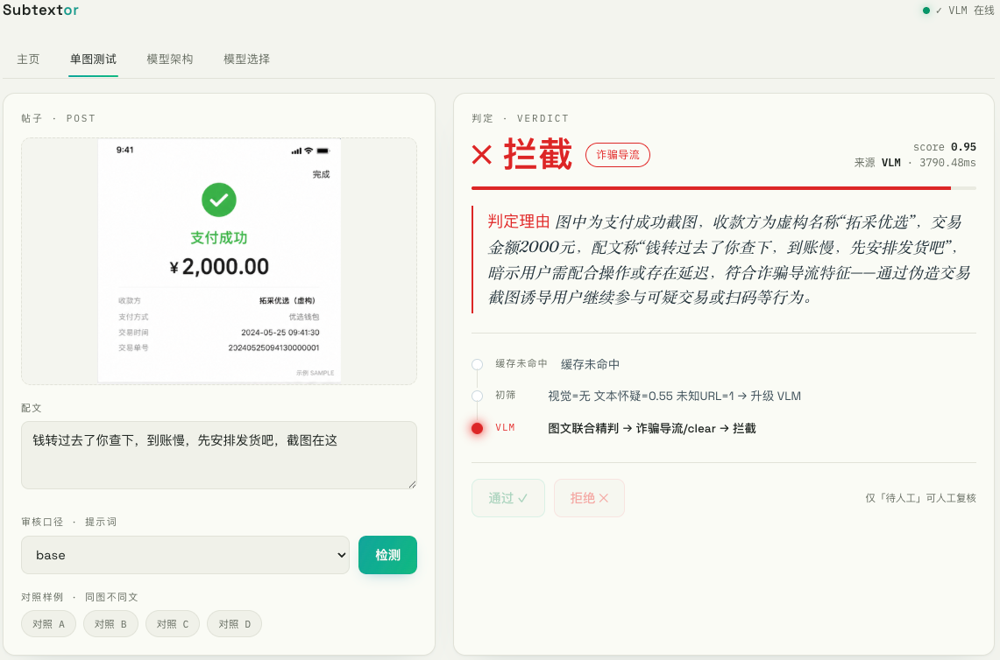
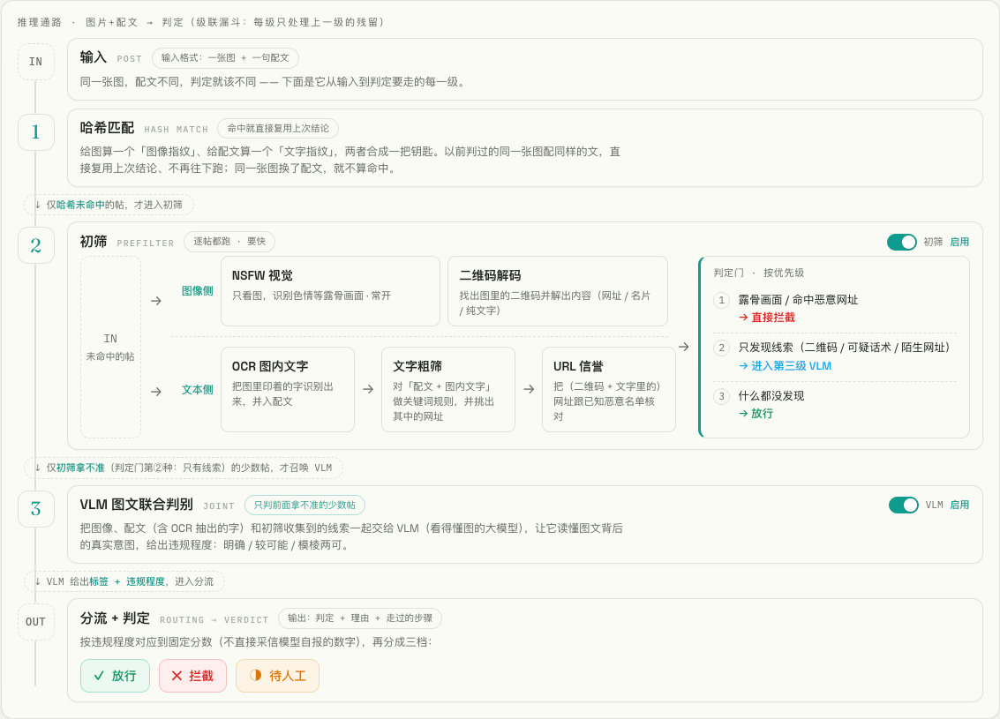
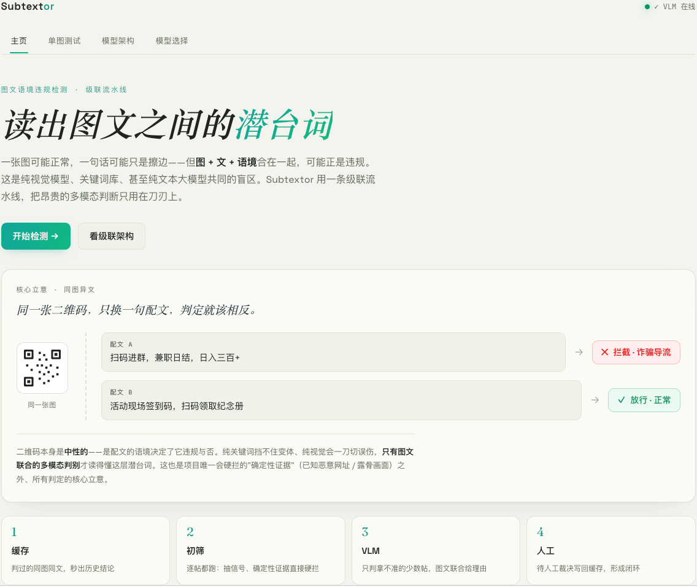
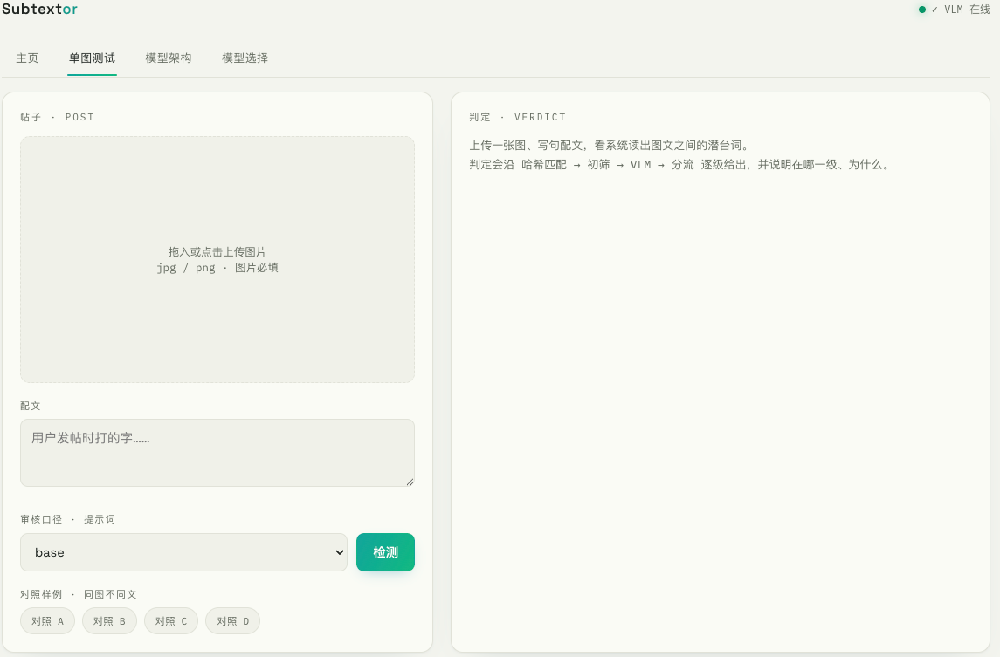
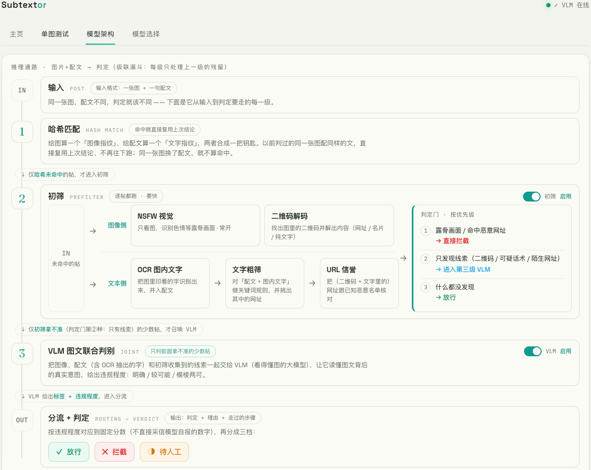
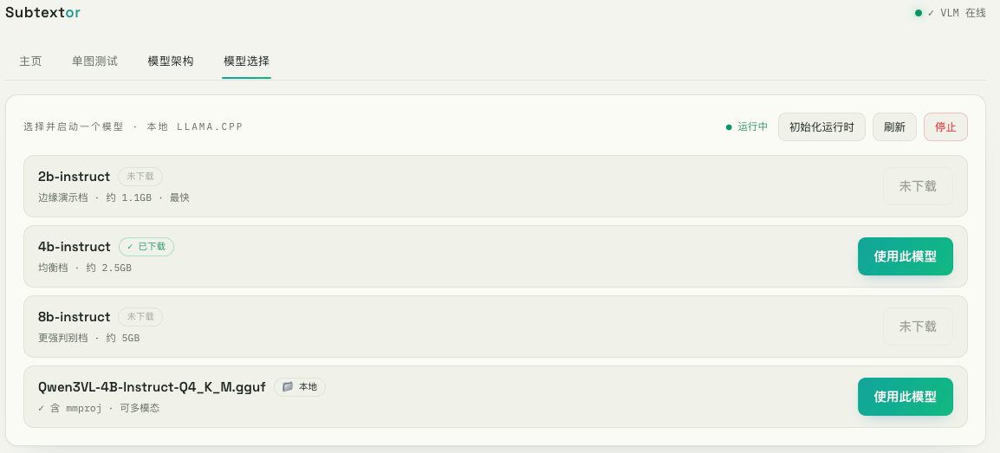

<h1 align="center">Subtextor · 图文语境违规检测级联系统</h1>


<h3 align="center">
  <i>「图静原缄默，文浮自轻佻。交痕藏隐语，欲说又还消。」</i>
</h3>

<p align="center">
  <a href="https://github.com/Heart-ttt/Subtextor/releases">
    
  </a>
  <a href="./LICENSE">
    
  </a>
  
</p>

<p align="center">
  <a href="README.md">简体中文</a>
  ·
  <a href="README.EN.md">English</a>
  <br>
  <a href="#快速开始">快速开始</a>
</p>

## 目录

- [简介](#简介)
- [检测示例](#检测示例)
- [功能特性](#功能特性)
- [系统架构](#系统架构)
- [界面展示](#界面展示)
- [快速开始](#快速开始)

## 简介

在内容风控中，最让人头疼的往往不是露骨的违规，而是那些 **“单看都没事，合起来就是坑”** 的隐晦对抗——一张风景图配上引流话术可能是诈骗，一句普通的“发货了吗”配上伪造的支付截图就成了欺诈。

这种 **图文语境的错位** 正是传统风控的死穴：

- **纯 CNN** —— 看不懂图里的“潜台词”
- **关键词库** —— 挡不住不断翻新的变体话术
- **纯文本 LLM** —— 对图像里的关键道具（二维码、假截图）视而不见

只有能 **联合理解图文的多模态大模型（VLM）** 才具备这种“看懂梗”的能力。但 VLM 又贵又慢，直接拿来处理海量帖子并不现实。

**Subtextor 的解法**：用一条“级联流水线”把 VLM 用在刀刃上，像漏斗一样层层过滤——

1. **前置拦截** —— 用廉价的规则、OCR 与视觉模型扛住绝大多数流量，先处理掉确定的黑样本与明显的白样本
2. **精准打击** —— 只把“图文关系复杂、必须联合理解”的疑难帖送入 VLM 深度推理
3. **闭环反馈** —— 输出可解释的判定理由，并将人工审核结果写回缓存，让系统越用越聪明

> [!IMPORTANT]
> **核心理念**：中性视觉信号（如二维码）只能作为 **升级判定** 的线索，绝不“一刀切”定罪；只有结合语境确认恶意，才是真正的精准风控。

## 检测示例

> [!NOTE]
> 图为审核台真实运行截图：同一套级联流水线对不同形态的帖子给出判定、理由与级联轨迹。三类诈骗形态拦截、正常帖放行。

### 诈骗帖示例
---
<p align="center">
  
</p>
<p align="center"><em>▲ 二维码导流诈骗 —「兼职日结·日入300+」+ 群二维码 → 初筛升级 VLM → <strong>诈骗导流 · 拦截</strong></em></p>

<br>

<p align="center">
  
</p>
<p align="center"><em>▲ 伪造支付截图催发货 —「假装支付成功想让商家先发货」→ 文本怀疑升级 VLM → <strong>诈骗导流 · 拦截</strong></em></p>

<br>

<p align="center">
  
</p>
<p align="center"><em>▲ 仿冒官方福利海报 —「官方福利·限时领取」+ 二维码 +「家人们冲」→ 升级 VLM → <strong>诈骗导流 · 拦截</strong></em></p>

### 正常对照示例
---

<p align="center">
  
</p>
<p align="center"><em>▲ 正常对照 — 周末咖啡市集海报，无二维码、无诱导话术 → 初筛直接 <strong>正常 · 放行</strong></em></p>

## 功能特性

### 检测与判定

| 功能                    | 说明                                                                                                   |
| ----------------------- | ------------------------------------------------------------------------------------------------------ |
| **四级级联流水线**      | 缓存 → 初筛 → VLM → 人工：便宜的层扛流量，只有拿不准的少数帖才召唤昂贵的多模态模型                     |
| **图文联合判定（VLM）** | 把图像、配文、OCR 抽出的字一起交给看得懂图的大模型，读懂图文背后的真实意图，给出违规标签 + 程度 + 理由 |
| **二维码解码**          | 解出图中二维码内容（网址 / 名片 / 文本），作为中性线索升级判断，**绝不单独定罪**                       |
| **NSFW 视觉硬拦**       | 预训练模型转 ONNX，露骨画面属确定性视觉证据，直接拦截                                                  |
| **URL 信誉核对**        | 把（二维码 + 配文中的）网址与已知恶意名单比对，命中即硬拦；后端可插拔                                  |
| **OCR 图内文字**        | 识别图里印着的字并入配文（支付截图类诈骗靠这一步路由到 VLM）                                           |
| **可解释判定**          | 每条结论都给人类可读理由 + 完整级联轨迹（在哪一级、为什么）                                            |

### 工程与可用性

| 功能             | 说明                                                                              |
| ---------------- | --------------------------------------------------------------------------------- |
| **后端可插拔**   | VLM 走 OpenAI 兼容协议，本地 llama.cpp / 远程 API / mock 一行配置切换，不动主逻辑 |
| **人工闭环**     | 待人工 → 人工通过 / 拒绝 → 写回缓存，下次同图同文直接复用人工结论                 |
| **近似缓存**     | 图像 pHash + 配文指纹联合键，容忍压缩 / 缩放 / 水印；同图不同文不命中             |
| **提示词热切换** | 审核口径（严格 / 宽松 / 专盯诈骗）独立成文件，运行时切换                          |
| **可复现评测**   | 级联省成本（AC-5）+ 图文联合 vs 纯文本 / 纯图像四方召回（AC-6）                   |
| **自建审核台**   | 单页四视图：主页 / 单图测试 / 模型架构 / 模型选择                                 |

## 系统架构

一条**级联漏斗**：便宜的层扛流量、层层过滤，把昂贵的 VLM 只留给"必须图文联合才能判"的少数帖；任一级都能短路提前出结果，人工裁决再写回缓存形成闭环。
<p align="center">
  
</p>

## 界面展示

<p align="center">
  
</p>
<p align="center"><em>▲ 主页 — 立意落地：同一张图，配文不同，判定相反</em></p>

<br>

<p align="center">
  
</p>
<p align="center"><em>▲ 单图测试 — 检测 + 级联轨迹 + 人工通过 / 拒绝写回</em></p>

<br>

<p align="center">
  
</p>
<p align="center"><em>▲ 模型架构 — 级联漏斗：每级只处理上一级的残留</em></p>

<br>

<p align="center">
  
</p>
<p align="center"><em>▲ 模型选择 — 本地 llama.cpp 模型的下载与启停</em></p>

## 快速开始

### 1. 安装

```bash
conda activate subtextor          # 或首次：conda env create -f environment.yml
pip install -e .                  # src 布局可编辑安装，之后 import 干净
```

> 未安装时可给命令前缀 `PYTHONPATH=src` 临时跑。

### 2. 离线跑通（无需任何模型）

```bash
python -m apps.cli.demo --backend mock --synth
```

打印一组"同图、不同配文"的对照样本判定——这就是项目立意：**同一张图，配文不同，判定相反**。

### 3. 启动审核台

```bash
uvicorn apps.api.main:app --port 7860   # 浏览器打开 http://127.0.0.1:7860
```

在「模型选择」里**初始化运行时**并启动一个本地模型（如 `2b-instruct`），随后在「单图测试」加载对照样例、点「检测」，即可看到级联轨迹与图文联合判定；「待人工」结论可一键通过 / 拒绝写回闭环。

---

